Supported Providers
-------------------

pyramid_sna uses the OAuth2 protocol under the hood so it should be
quite easy to support any Identity Provider that uses this protocol.

pyramid_sna does not store OAuth2 tokens anywhere and in every authentication
flow it asks the provider for a new token, which is used to fetch user
attributes.

At the moment, only Google, Facebook and Microsoft Live Connect are supported.

Google
^^^^^^

In order to add a *Login with Google* button to your application you
need to follow 3 simple steps:

#. Register your applicaton at Google to get your API keys, add some
   branding information and tell Google where your callback URL is.
#. Configure your application with the information obtained in the
   previous step.
#. Write a callback function to process the user information that Google
   sends and create an authenticated session for that user.

Registering your application at Google
""""""""""""""""""""""""""""""""""""""

First you need a Google Account so create one if you don't already have it.
Authenticate yourself using that account and open the following link in
your browser: https://code.google.com/apis/console/?api=plus

If this is the first time you use Google APIs console you will see the
following page where you should click on the big *Create project...*
button:

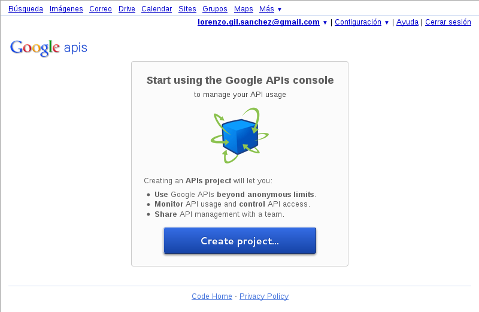

If you have registered more projects you will get to the default project
page and you will have to open the dropdown button on the top left hand
corner and click on the *Create ...* option:

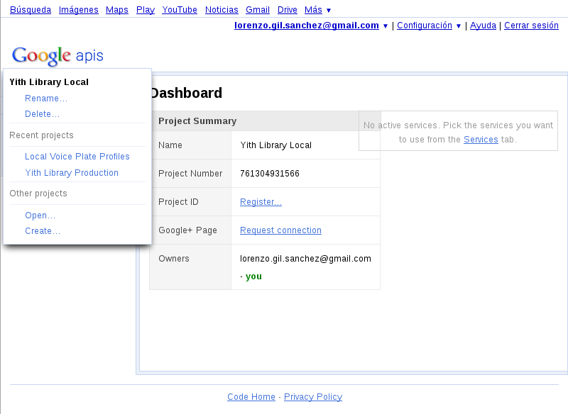

If this is your first project and click on the *Create project...* button,
Google will name it *API project* and will make it the current project. We
recommend that you change that name using the *Rename* option in the
menu of the top left hand corner.

If this was not your first project and you selected the *Create ...*
option of that menu, Google will ask you for a name in a little modal
dialog:

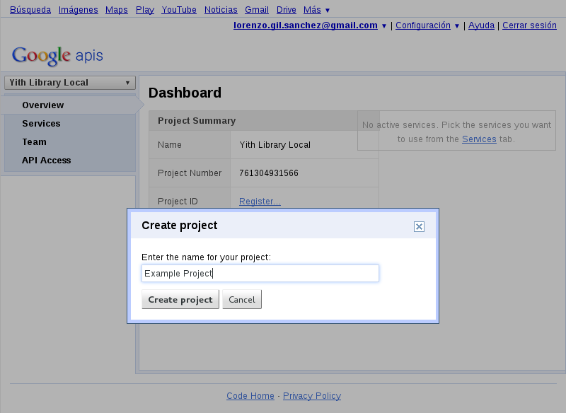

In either case you will end up in the project home screen where a list
of services is shown so you can enable or disable them for this particular
project:

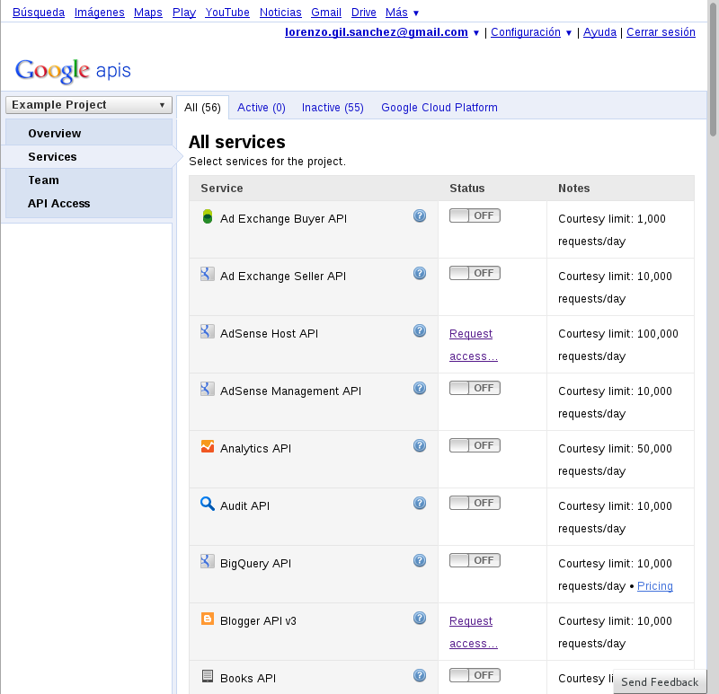

Since we are only using Google for authentication purposes we are not
going to enable any of the services. Instead we will click on the
*API Access* option of the left menu. This will take us to the *API
Access* page where we can create an OAuth2 client ID:

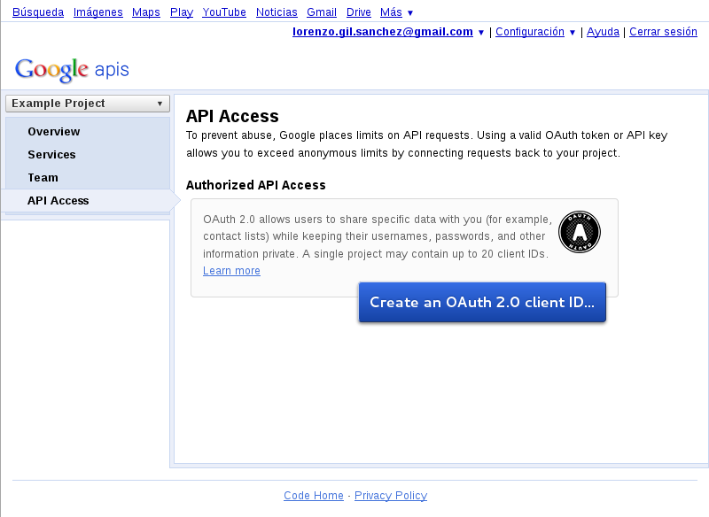

After clicking on the *Create an OAuth 2.0 client ID...* button a
wizard composed of several dialogs will appear.

In the first dialog we will input the project branding information (Name,
Logo URL and Home Page URL). The final user will see this information
when logging in through Google into your application:

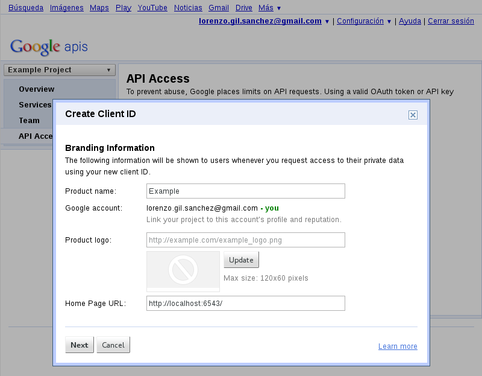

In the next dialog we will specify the application type and hostname.
pyramid_sna needs the application type to be *Web application*, which
is the default option for this setting in the Client ID Settings dialog.
In the hostname setting you can specify the protocol (http or https) and
the name of your host. For development you can enter localhost or 127.0.0.1
as the name of the host. We also need to change the Redirect URI setting
but this dialog won't allow us to do se. We'll change it later.

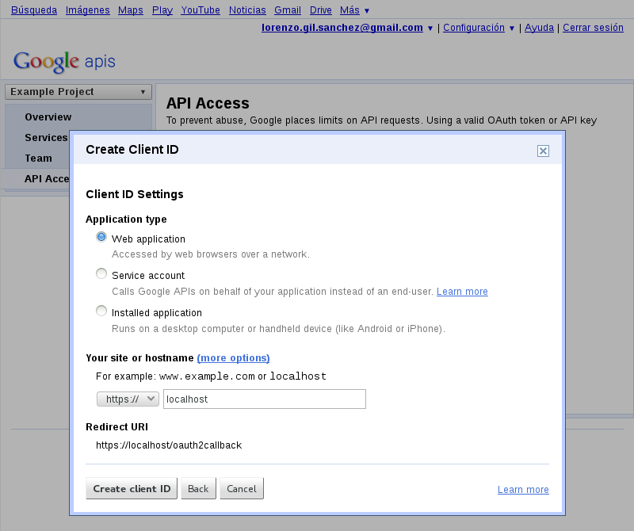

After clicking on the *Create client ID* button you will see the API Access
home page where all the information about this Client ID is shown:

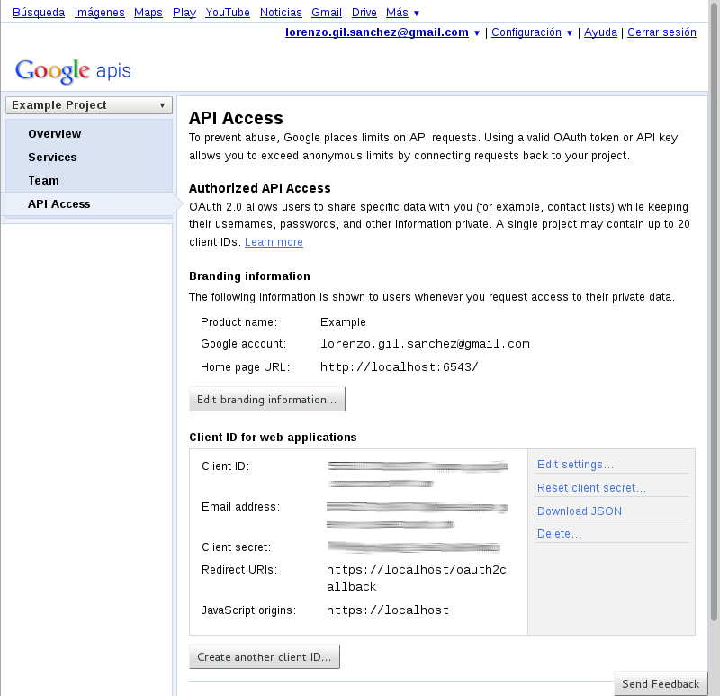

We are almost finished but first we need to fix the *Redirect URIs* setting
clicking on the *Edit settings...* link on the bottom righ hand corner:

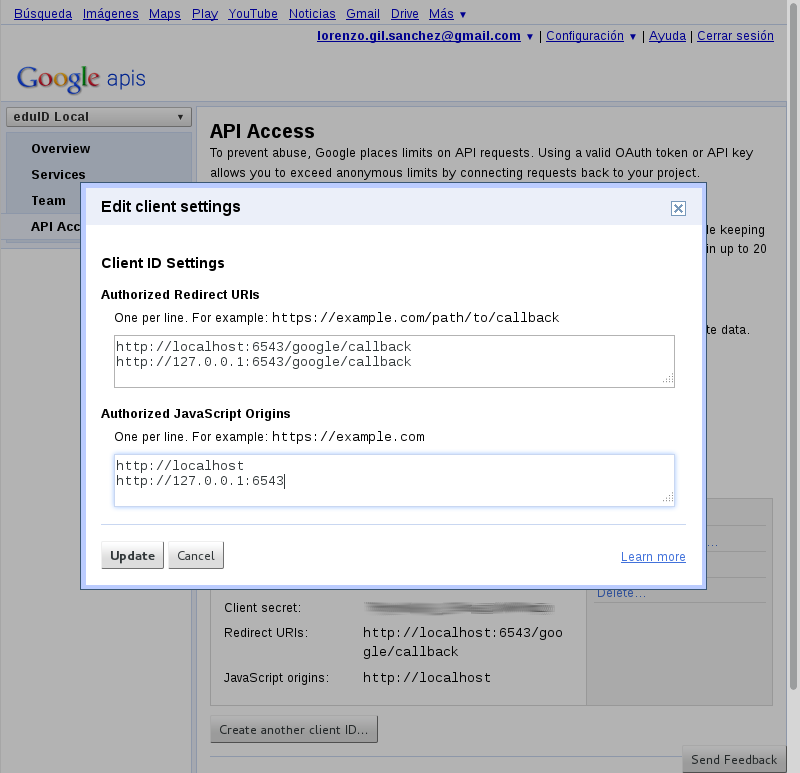

In this dialog we can enter as many URIs as we want for the *Authorized
Redirect URIs* and *Authorized Javascript Origins*. In the image you can
see sane values for development mode. Note that the hostname 0.0.0.0 is
not valid for Google since it is too permisive.

Congratulations! you just finished registering and configuring your project
at Google APIs console. You will need the *Client ID* and *Client secret*
values in the next phase.

Configuring the settings
""""""""""""""""""""""""
In pyramid_sna there are some required settings and some optional settings.

If any of the required settings is disabled a boolean setting called
*google_auth_enabled* will be set to False. Otherwise it will be True.

Also if the required settings are missing the views that handle the
authentication process ('google_login' and 'google_callback') will not
be registered.

Required settings
.................

There are 3 required settings:

- **google_client_id** this should be set to the *Client ID* value obtained
  while registering your project in the Google APIs console.
- **google_client_secret** this should be set to the *Client Secret* value
  obtained while registering your project in the Google APIs console.
- **google_callback** this should be set to the full path to a Python
  function that will be called after a succcessfull authentication. Check
  the next section *Writing the callback function* for more information
  about this function.

Optional settings
.................

The following settings have sane defaults so you shouldn't ned to change
them in most cases:

- **google_scope** is space separated list of scopes. In OAuth2 a scope
  indicates what permissions are given to an application. The default scope
  includes the email and profile permissions: https://www.googleapis.com/auth/userinfo.email https://www.googleapis.com/auth/userinfo.profile
  Check Google documentation to learn about available scopes.
- **google_auth_uri** is the URI where the OAuth2 authentication endpoint
  is located. Its default value is https://accounts.google.com/o/oauth2/auth
  and you should not change it unless Google change it.
- **google_token_uri** is the URI where the OAuth2 token endpoint is located.
  Its default value is https://accounts.google.com/o/oauth2/token and you
  should not change it unless Google change it.
- **google_user_info_uri** is the URI where the user information endpoint
  is located. This is called by pyramid_sna to fetch user attributes after
  a successfull authentication. Its default value is
  https://www.googleapis.com/oauth2/v1/userinfo and you should not change it
  unless Google change it.

Example configuration
.....................

The following is an example configuration for the Google provider that
will looks similar to what you should put in your .ini configuration file:

.. code-block:: ini

   # Google authentication
   google_client_id = 1234567890.apps.googleusercontent.com
   google_client_secret = ABCDEFGHI_1234567890abcd
   google_callback = my_project.sna_callbacks.google_callback

Please note that these are not valid values and you should not copy and
paste them into your project. **They will not work.**

Writing the callback function
"""""""""""""""""""""""""""""
The callback function is called by pyramid_sna after a succesfull login
with Google. The arguments that are passed to this function are the
request object, the Google user id and a dictionary with user attributes
(screen_name, first_name, last_name and email address). This function
should return a Pyramid Response object which will be send to the user's
browser.

The typical things that a callback function does are:

- Create or update a user object in the application persistent storage.
- Call pyramid.security.remember to create an authenticated session for
  this user.
- Returns an HTTPFound object to redirect the user to an application view.

Example that persist the user in MongoDB:

.. code-block:: py

   from pyramid.httpexceptions import HTTPFound
   from pyramid.security import remember

   def google_callback(request, user_id, attributes):
       # Create or update the user in MongoDB
       user = request.db.users.find_one({'google_id': user_id})
       if user is None:
           user_data = {'google_id': user_id}
           user_data.update(attributes)
           user_id = request.db.users.insert(user_data)
       else:
           request.db.users.update({'google_id': user_id}, attributes)
           user_id = user['_id']

       # remember the user by sending a cookie
       remember_headers = remember(request, str(user_id))

       # return a redirect response to the home page
       return HTTPFound(location='/', headers=remember_headers)

Facebook
^^^^^^^^
In order to add a *Login with Facebook* button to your application you
need to follow 3 simple steps:

#. Register your applicaton at Facebook to get your API keys, add some
   branding information and tell Facebook where your aplication URL is.
#. Configure your application with the information obtained in the
   previous step.
#. Write a callback function to process the user information that Facebook
   sends and create an authenticated session for that user.

Registering your application at Facebook
""""""""""""""""""""""""""""""""""""""""
First you need a Facebook Account so create one if you don't already have it.
Authenticate yourself using that account and open the following link in
your browser: https://developers.facebook.com/apps/?action=create

A dialog will appear asking your for the name of your application. Don't worry
about the *App Namespace* field. It's optional and we will not need it.

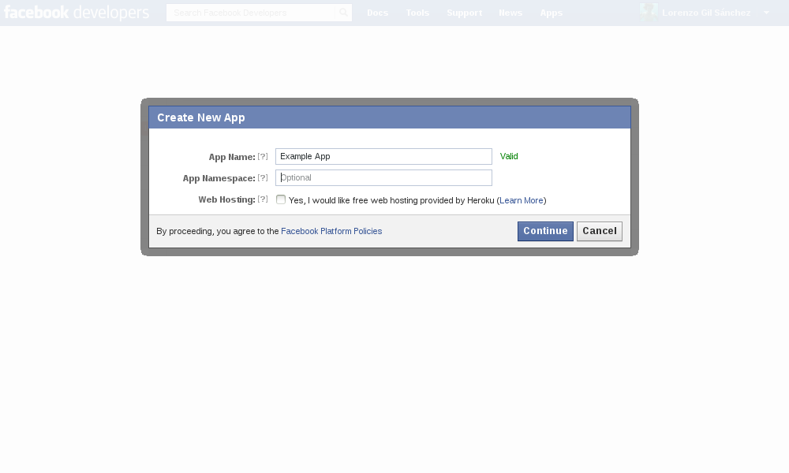

After you fill up the *App Name* field and click on the *Continue* button you
will be prompted with a Captcha dialog, which you need to solve:

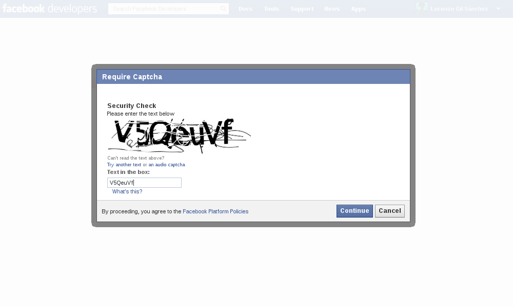

Then the application is created and you are redirected to the main application
page where you can see a summary of all its properties. In this page there
are three important things you need to do:

- Save the **App ID** and **App Secret** values because you will need them
  when configuring the settings of your Pyramid application.
- Set the **App Domains** field to the domains of your application. For
  development purposes you can enter *localhost* here.
- Select the **Website with Facebook Login** option and enter your site
  URL. If you are in development you can enter *http://localhost:6543/*

After these changes you have to click on the *Save Changes* button.

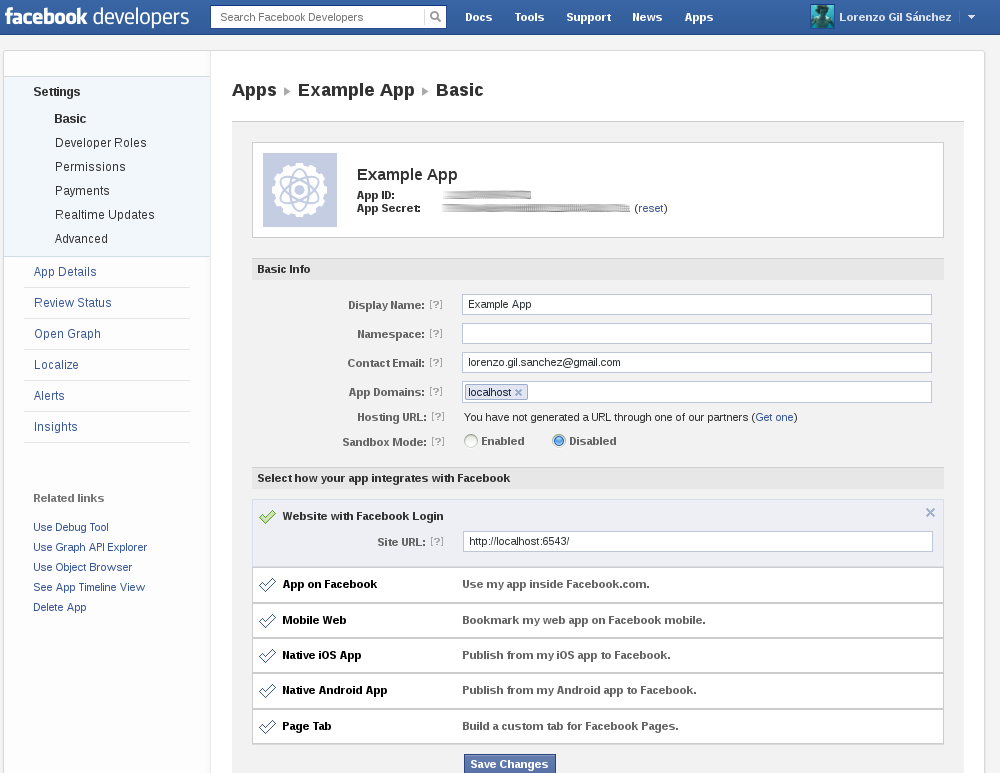

Configuring the settings
""""""""""""""""""""""""
In pyramid_sna there are some required settings and some optional settings.

If any of the required settings is disabled a boolean setting called
*facebook_auth_enabled* will be set to False. Otherwise it will be True.

Also if the required settings are missing the views that handle the
authentication process ('facebook_login' and 'facebook_callback') will not
be registered.

Required settings
.................

There are 3 required settings:

- **facebook_app_id** this should be set to the *App ID* value obtained
  while registering your project in the Facebook Developers site.
- **facebook_app_secret** this should be set to the *App Secret* value
  obtained while registering your project in the Facebook Developers site.
- **facebook_callback** this should be set to the full path to a Python
  function that will be called after a succcessfull authentication. Check
  the next section *Writing the callback function* for more information
  about this function.

Optional settings
.................

The following settings have sane defaults so you shouldn't ned to change
them in most cases:

- **facebook_scope** is space separated list of scopes. In OAuth2 a scope
  indicates what permissions are given to an application. The default scope
  includes the email permissions: email
  Check Facebook documentation to learn about available scopes.
- **facebook_dialog_oauth_url** is the URL where the OAuth2 authentication
  endpoint is located. Its default value is
  https://www.facebook.com/dialog/oauth/ and you should not change it unless
  Facebook change it.
- **facebook_access_token_url** is the URL where the OAuth2 token endpoint is
  located. Its default value is https://graph.facebook.com/oauth/access_token
  and you should not change it unless Facebook change it.
- **facebook_basic_information_url** is the URIL where the user information
  endpoint is located. This is called by pyramid_sna to fetch user attributes
  after a successfull authentication. Its default value is
  https://graph.facebook.com/me and you should not change it unless Facebook
  change it.

Example configuration
.....................

The following is an example configuration for the Facebook provider that
will looks similar to what you should put in your .ini configuration file:

.. code-block:: ini

   # Facebook authentication
   facebook_app_id = 123456789012345
   facebook_app_secret = abcdef1234567890abcdef1234567890
   facebook_callback = my_project.sna_callbacks.facebook_callback

Please note that these are not valid values and you should not copy and
paste them into your project. **They will not work.**

Writing the callback function
"""""""""""""""""""""""""""""
The callback function is called by pyramid_sna after a succesfull login
with Facebook. The arguments that are passed to this function are the
request object, the Facebook user id and a dictionary with user attributes
(screen_name, first_name, last_name and email address). This function
should return a Pyramid Response object which will be send to the user's
browser.

The typical things that a callback function does are:

- Create or update a user object in the application persistent storage.
- Call pyramid.security.remember to create an authenticated session for
  this user.
- Returns an HTTPFound object to redirect the user to an application view.

Example that persist the user in MongoDB:

.. code-block:: py

   from pyramid.httpexceptions import HTTPFound
   from pyramid.security import remember

   def facebook_callback(request, user_id, attributes):
       # Create or update the user in MongoDB
       user = request.db.users.find_one({'facebook_id': user_id})
       if user is None:
           user_data = {'facebook_id': user_id}
           user_data.update(attributes)
           user_id = request.db.users.insert(user_data)
       else:
           request.db.users.update({'facebook_id': user_id}, attributes)
           user_id = user['_id']

       # remember the user by sending a cookie
       remember_headers = remember(request, str(user_id))

       # return a redirect response to the home page
       return HTTPFound(location='/', headers=remember_headers)

Microsoft Live Connect
^^^^^^^^^^^^^^^^^^^^^^

In order to add a *Login with Microsoft Live Connect* button to your
application you need to follow 3 simple steps:

#. Register your application at Live Connect Developer Center to get your API
   keys, add some branding information, supported languages and tell Microsoft
   where your callback URL is.
#. Configure your application with the information obtained in the
   previous step.
#. Write a callback function to process the user information that Microsoft
   sends and create an authenticated session for that user.

Registering your application at Microsoft Live Connect
""""""""""""""""""""""""""""""""""""""""""""""""""""""

First you need a Hotmail, Outlook.com or MSN Account so create one if you don't
already have it. Open the follow link in your browser:
https://account.live.com/developers/applications/create?tou=1 and authenticate
yourself using your account.

A simple form appear asking you for the name of your application. Pay attention
to the name format indications in the Application name field. The name only can
have letters, digits, underscore and it is limited to 129 characters.

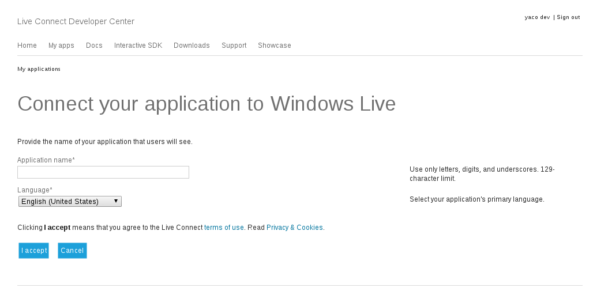

After you fill up the *Application name* field and you have selected the
preferred language for your application, you should read the terms of use and
Privacy & cookies and click on *I accept* button.

Then the application is created and you are redirected to the main application
page where you can see the client id and client secret keys. You should fill up
the *Redirect domain* field to ensure the Live Connect  use that domain in your
Oauth 2.0 redirects URI. For development purposes you can enter  *localhost*.

After this change you have to click on the *Save* button.

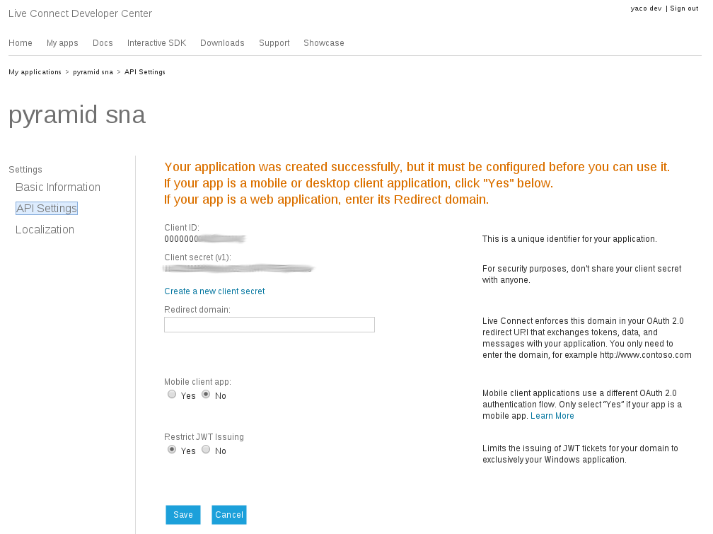

Configuring the settings
""""""""""""""""""""""""
In pyramid_sna there are some required settings and some optional settings.

If any of the required settings is disabled a boolean settings called
*liveconnect_auth_enabled* will be set to False.

Also if the required settings are missing the views that handle the
authentication process ('liveconnect_login' and 'liveconnect_callback') will
not be registered.

Required settings
.................

There are 3 required settings:

- **liveconnect_client_id** this should be set to the *Client ID* value
  obtained while registering your application in the Live Connect Developer
  Center site.
- **liveconnect_client_secret** this should be set to the *App Secret* value
  obtained while registering your application in the Live Connect Developer
  Center site.
- **liveconnect_callback** this should be set to the full path to a Python
  function that will be called after a succcessfull authentication. Check
  the next section *Writing the callback function* for more information
  about this function.

Optional settings
.................

The following settings have sane defaults so you shouldn't ned to change
them in most cases:

- **liveconnect_scope** is space separated list of scopes. In OAuth2 a scope
  indicates what permissions are given to an application. The default scope
  includes the email permissions: wl.basic wl.emails.
  Check documentation in the Live Connect Developer Center site to learn about
  available scopes.
- **liveconnect_auth_uri** is the URL where the OAuth2 authentication endpoint
  is located. Its default value is https://login.live.com/oauth20_authorize.srf
  and you should not change it unless Microsoft change it.
- **liveconnect_token_uri** is the URL where the OAuth2 token endpoint is
  located. Its default value is https://login.live.com/oauth20_token.srf
  and you should not change it unless Microsoft change it.
- **liveconnect_basic_information_uri** is the URI where the user information
  endpoint is located. This is called by pyramid_sna to fetch user attributes
  after a successfull authentication. Its default value is
  https://apis.live.net/v5.0/me and you should not change it unless Microsoft
  change it.

Example configuration
.....................

The following is an example configuration for the Microsoft Live Connect
provider that will looks similar to what you should put in your .ini
configuration file:

.. code-block:: ini

   # Microsoft Live connect authentication
   liveconnect_client_id = 0000000012345678
   liveconnect_client_secret = aaAA1234123412341234123412341234
   liveconnect_callback = my_project.sna_callbacks.liveconnect_callback

Please note that these are not valid values and you should not copy and
paste them into your project. **They will not work.**

Writing the callback function
"""""""""""""""""""""""""""""
The callback function is called by pyramid_sna after a succesfull login
with Microsoft Live Connect. The arguments that are passed to this function are
the request object, the Microsoft Live Connect user id and a dictionary with
user attributes (screen_name, first_name, last_name and email address). This
function should return a Pyramid Response object which will be send to the
user's browser.

The typical things that a callback function does are:

- Create or update a user object in the application persistent storage.
- Call pyramid.security.remember to create an authenticated session for
  this user.
- Returns an HTTPFound object to redirect the user to an application view.

Example that persist the user in MongoDB:

.. code-block:: py

   from pyramid.httpexceptions import HTTPFound
   from pyramid.security import remember

   def liveconnect_callback(request, user_id, attributes):
       # Create or update the user in MongoDB
       user = request.db.users.find_one({'liveconnect_id': user_id})
       if user is None:
           user_data = {'liveconnect_id': user_id}
           user_data.update(attributes)
           user_id = request.db.users.insert(user_data)
       else:
           request.db.users.update({'liveconnect_id': user_id}, attributes)
           user_id = user['_id']

       # remember the user by sending a cookie
       remember_headers = remember(request, str(user_id))

       # return a redirect response to the home page
       return HTTPFound(location='/', headers=remember_headers)

